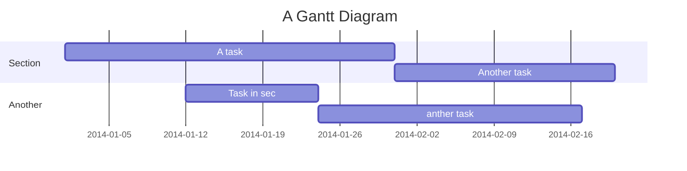

# 2023-08-10

## mermaid

hackmd 有支援 mermaid 語法, example:

## RJ

遇到 gitlab 加 RSA key 有問題

[Use SSH keys to communicate with GitLab | GitLab](https://docs.gitlab.com/ee/user/ssh.html#supported-ssh-key-types)

## FlyPie

- "全人類都應該學習 Markdown"
  - https://note.com/smartcamp_design/n/nd9e58517f07e

## jim

- Arch Linux, KDE, USB stick 開機, 硬碟加密
- [Linus Torvalds: The mind behind Linux | TED Talk](https://www.ted.com/talks/linus_torvalds_the_mind_behind_linux)
    - 14:20 處
- [mypy - Optional Static Typing for Python](https://mypy-lang.org/)
- `gcc -S hello.c` 可輸出 assembly code
- https://www.slideshare.net/jserv/jit-compiler
- [用十分鐘搞懂 λ-Calculus](https://www.slideshare.net/ccckmit/calculus-253542231)
- [博客來-EN帶你寫個作業系統：來趟RISC-V開發輕旅行(iThome鐵人賽系列書)](https://www.books.com.tw/products/0010933946)
- [λ演算 - 維基百科，自由的百科全書](https://zh.wikipedia.org/zh-tw/%CE%9B%E6%BC%94%E7%AE%97)
- [λ演算範例: javascript 版](https://github.com/gtramontina/lambda/blob/master/lambda.js)
- [λ演算範例: python 版](https://gitlab.com/cccnqu111/alg/-/blob/master/09c-lambdaCalculus/lambdaCalculus.py)
- [邱奇-圖靈論題 - 維基百科，自由的百科全書](https://zh.wikipedia.org/zh-tw/%E9%82%B1%E5%A5%87-%E5%9B%BE%E7%81%B5%E8%AE%BA%E9%A2%98)
- [Smart Game Format - Wikipedia](https://en.wikipedia.org/wiki/Smart_Game_Format)
- [Extended Backus–Naur form - Wikipedia](https://en.wikipedia.org/wiki/Extended_Backus%E2%80%93Naur_form) & [Yacc - Wikipedia](https://en.wikipedia.org/wiki/Yacc)
- [Secure, Fast, & Private Web Browser with Adblocker | Brave](https://brave.com/)
- [Revolution OS - 2001 - Multilingual (16 languages) - YouTube](https://www.youtube.com/watch?v=Eluzi70O-P4)
- [Houge Langley - YouTube](https://www.youtube.com/channel/UC7h0cmpGuMcq2g1LXzykEIw)

## Mat

- https://it-tools.tech/ , open source, self-hosted

